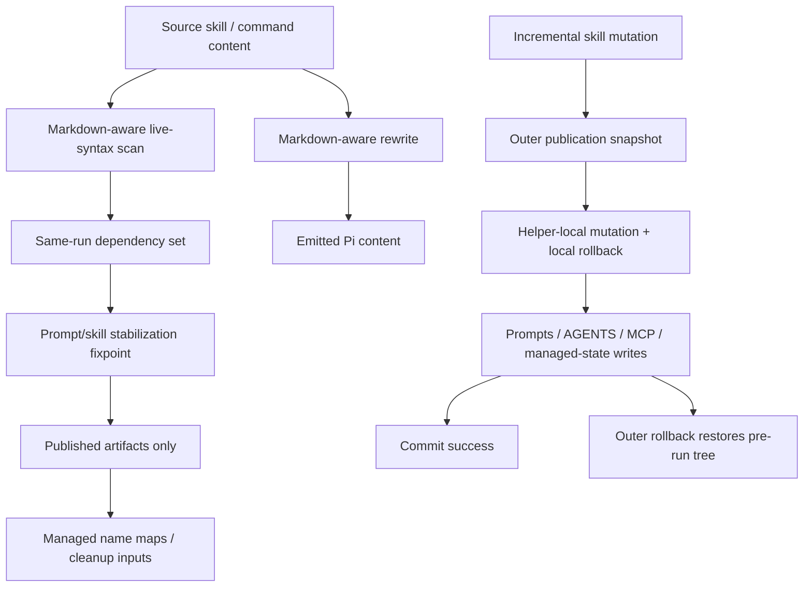
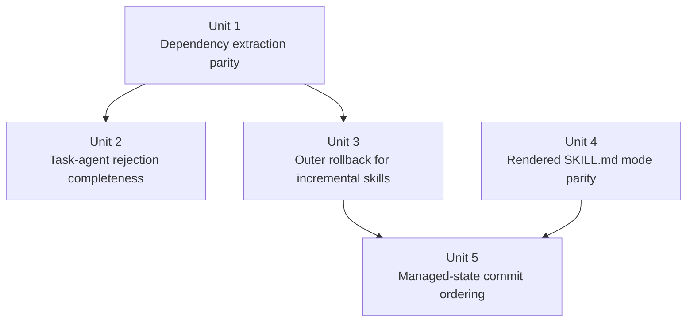

# fix: Address deep Pi review follow-up bugs on PR #288

## Overview

Harden the Pi install/sync implementation so skill installation for the Claude Code plugin behaves correctly under same-run dependency rewrites, incremental skill updates, rollback, and permission preservation. This plan expands beyond the two validated Codex findings to cover the surrounding bug cluster that shares the same rewrite and transaction seams.

Delivery strategy: land this as an ordered series of focused commits on the existing PR branch, grouped by bug cluster rather than as one undifferentiated patch. Unit 1 and Unit 2 can land independently, Units 3 and 5 are the transactional hardening stream, and Unit 4 can land independently so mode-parity fixes do not block rollback-safety work.

## Problem Frame

The current Pi integration has drifted into two inconsistent models of reality. The rewrite pipeline in `src/utils/pi-skills.ts` is markdown-aware, punctuation-aware, and supports multiple live reference shapes, but same-run dependency extraction is still a narrow regex pass over raw text. In parallel, incremental copied-skill updates are locally rollback-safe inside the materialization helper, but the outer sync/install transaction often does not snapshot those skill directories before later steps mutate prompts, managed state, compat resources, or MCP config. The result is a set of bugs where Pi can publish an artifact with a dangling rewritten ref, incorrectly demote documentation-only artifacts, silently normalize unresolved first-party task agents to bogus leaf names, or leave the skill tree ahead of restored managed state after a failed run.

## Requirements Trace

- R1. Same-run dependency extraction must match actual Pi rewrite semantics for all supported live reference forms and must ignore literal/example text that is not rewritten.
- R2. Unresolved first-party task-agent refs must fail closed during Pi sync/install instead of silently falling back to normalized leaf names.
- R3. Sync and install must snapshot incrementally updated skill directories before later outer-transaction work so rollback restores the entire pre-run published state.
- R4. Pi materialization must preserve source file mode for both copied files and rewritten `SKILL.md` files, including mode-only changes and no-op reruns.
- R5. Managed manifest/verification commit ordering must remain rollback-safe and fail closed under write or snapshot failure.
- R6. Final managed state, published-only name maps, and on-disk Pi outputs must be derived only from post-stabilization published artifacts.

## Scope Boundaries

- No redesign of Pi status classes, policy/trust models, or managed-state schema beyond what is required to fix rollback ordering and published-state correctness.
- No new long-lived alias domains; canonical logical names, same-run resolvable aliases, and emitted safe names remain separate concepts.
- No broader markdown parser replacement for all Pi transforms; the goal is parity with existing rewrite semantics, not a new document engine.
- No changes to non-Pi targets except where existing shared helper behavior already defines the correct contract.

## Context & Research

### Relevant Code and Patterns

- `src/utils/pi-skills.ts` is the central authority for Pi rewrite behavior, same-run extraction, copied-skill materialization, rendered `SKILL.md` rewriting, fast-path metadata, and helper-local rollback.
- `src/sync/pi.ts` owns sync pass orchestration, same-run stabilization, rerun narrowing, publication snapshots, managed-state derivation, and rollback.
- `src/sync/pi-skills.ts` and `src/sync/commands.ts` are the sync entry points that currently attach `sameRunDependencies` and strict rewrite options.
- `src/targets/pi.ts` is the install/writer transaction owner and must stay behaviorally aligned with sync for copied-skill updates and managed-state rollback.
- `src/utils/pi-managed.ts` already stages manifest/verification writes together and is the right place to mirror when reasoning about commit ordering.
- `src/utils/files.ts` is the canonical atomic-write and mode-preservation contract; file mode is already part of equality/no-op semantics.
- `tests/sync-pi.test.ts`, `tests/pi-writer.test.ts`, `tests/files.test.ts`, and `tests/pi-converter.test.ts` already act as contract-level coverage for Pi rewrite semantics, transactional behavior, and permission handling.

### Institutional Learnings

- `docs/plans/2026-04-02-004-fix-pi-review-bug-batch-plan.md`: preserve the distinction between canonical logical name, same-run resolvable alias, and emitted safe name. Final managed state must only include published artifacts.
- `docs/plans/2026-04-01-002-fix-pi-transactional-parity-followups-plan.md`: rollback, cleanup, and optimization must consume verified previous state and successfully committed current outputs only.
- `docs/plans/2026-03-20-003-fix-pi-symlink-boundary-and-materialization-safety-plan.md`: shared Pi materialization helpers are the contract owner; sync/install should not diverge semantically.
- `docs/plans/2026-03-20-004-fix-pi-routing-modes-and-cleanup-plan.md`: source mode preservation is part of correctness for materialized skill trees, including rewritten files.
- `docs/plans/2026-03-31-005-fix-pi-final-resolution-and-compat-seams-plan.md`: unresolved first-party refs must fail closed rather than silently retargeting to leaf-name fallbacks.
- `docs/solutions/codex-skill-prompt-entrypoints.md`: preserve canonical identity internally and only apply target-safe wrappers at the boundary.
- `docs/solutions/integrations/cross-platform-model-field-normalization-2026-03-29.md`: prefer one authoritative normalization source and omit/fail-closed when mapping certainty is not real.

### External References

- None. Local Pi patterns and prior plans are strong enough, and this work is primarily about internal contract consistency rather than framework semantics.

## Key Technical Decisions

- Make same-run dependency extraction derive from the same markdown-aware live-syntax model as rewrite, rather than extending the current raw regex scan.
  Rationale: the rewrite contract already defines what Pi treats as live syntax versus literal/example text. A second looser parser guarantees more drift.
- Fix unresolved first-party task-agent rejection in the shared name-resolution layer rather than at individual call sites.
  Rationale: `Task ...`, `Run subagent ...`, and `Run ce_subagent ...` all flow through the same task-agent normalization seam and must share one fail-closed policy.
- Treat incremental skill directory updates as outer-transaction mutations that require publication snapshots before later work continues.
  Rationale: helper-local rollback only protects failures during the skill update itself; it cannot restore pre-run state after later prompt/manifest/shared-resource failures.
- Extend mode preservation to rewritten `SKILL.md` writes and rendered incremental ops, not just copied files.
  Rationale: Pi treats rewritten and copied files as part of the same materialized skill tree. Permission drift on rewritten `SKILL.md` is still a correctness bug.
- Keep managed manifest/verification commit ordering fail closed even if that requires a characterization-first pass before choosing the narrowest code change.
  Rationale: managed-state drift changes trust, cleanup authority, and runtime fallback behavior, so this boundary needs explicit protection.

## Open Questions

### Resolved During Planning

- Should this update the existing `2026-04-02-005` plan or become a new plan?
  Resolution: new plan. The existing plan covers the earlier two findings; this planning pass expands into a broader cross-cutting bug cluster and should be tracked separately.
- Should same-run extraction extend persisted alias state to make more lookups succeed?
  Resolution: no. Extraction/rewrite parity should improve current-run dependency truth, but final managed state must remain published-only.
- Should rollback fixes live only inside `copySkillDirForPi()`?
  Resolution: no. The helper-local rollback stays, but sync/install must also snapshot the skill directory before any outer transaction can later fail.

### Deferred to Implementation

- Whether the cleanest extraction implementation is a shared tokenizer over markdown lines, a dependency-collector variant of `transformPiBodyContent()`, or a smaller refactor that reuses protected-line handling without duplicating rewrite behavior.
  Why deferred: the planned behavior is clear, but the narrowest code shape depends on the current helper layout once editing begins.
- Whether managed-state ordering is best fixed by moving outer snapshots earlier, reusing `writePiManagedState()` staging more directly, or introducing a smaller wrapper for rollback capture.
  Why deferred: this is an implementation-shape question that depends on how much existing staging can be reused without widening the transaction API.

## High-Level Technical Design

> *This illustrates the intended approach and is directional guidance for review, not implementation specification. The implementing agent should treat it as context, not code to reproduce.*

The key design constraint is that `B` and `C` must agree on what counts as a live dependency, and `I -> N` must behave transactionally across both sync and install even when the skill update itself succeeded earlier.

## Implementation Units

- [x] **Unit 1: Make same-run dependency extraction match live Pi rewrite semantics**

**Goal:** Replace the current raw regex dependency scan with a markdown-aware live-syntax scan that matches how Pi actually rewrites content.

**Requirements:** R1, R6

**Dependencies:** None

**Files:**
- Modify: `src/utils/pi-skills.ts`
- Modify if needed: `src/sync/pi.ts`
- Test: `tests/sync-pi.test.ts`
- Test: `tests/pi-converter.test.ts`

**Approach:**
- Make same-run extraction reuse the same concept of “live syntax” versus literal/example text already enforced by the rewrite path.
- Support the full set of live same-run shapes the rewriter accepts: `Task ...`, `Run subagent ...`, `Run ce_subagent ...`, `/skill:...`, `/prompt:...`, `/prompts:...`, and unqualified as well as `claude-home:`-qualified refs.
- Normalize extraction token boundaries the same way slash-command rewriting already does so trailing punctuation is removed consistently.
- Keep extraction concerned with current-run dependency truth only; do not mutate persisted alias domains or expand managed `nameMaps`.

**Execution note:** Add characterization coverage first for punctuation, code/example text, and unqualified/structured ref shapes before changing the extractor.

**Patterns to follow:**
- `src/utils/pi-skills.ts` `transformPiBodyContent()` and `transformPiMarkdownLine()`
- `tests/pi-converter.test.ts` accepted rewrite forms for `Task` and `Run subagent`
- `docs/plans/2026-04-02-004-fix-pi-review-bug-batch-plan.md`

**Test scenarios:**
- Happy path: `/skill:claude-home:ce:plan,` and `/prompt:claude-home:plan-review.` demote/publish based on the sibling’s real source name, not the punctuated token.
- Happy path: `/prompts:claude-home:plan-review,` participates in same-run dependency tracking with the same punctuation trimming and sibling-name resolution rules as rewrite.
- Happy path: unqualified `Task ce:plan(feature_description)` participates in same-run dependency tracking and demotes when the sibling skill is unpublished.
- Happy path: `Run subagent with agent="claude-home:ce:plan"` and `Run ce_subagent with agent="claude-home:ce:plan"` participate in same-run dependency tracking.
- Edge case: inline code, fenced code, indented code, and blockquote examples containing `claude-home:` refs do not create same-run dependencies.
- Error path: dependency on a sibling that becomes `unsupported-final` or `blocked-by-policy` does not leave the dependent artifact published with a dangling rewritten ref.
- Integration: a mixed graph with prompts and skills reaches the same final published set in both narrow and full rerun modes after the extractor change.

**Verification:**
- Dependency extraction and emitted rewrite behavior agree for all supported live ref forms.
- Documentation-only example text no longer causes retry/demotion.
- Final published outputs and managed state omit dependents of unpublished siblings.

- [x] **Unit 2: Complete fail-closed handling for unresolved first-party task-agent refs**

**Goal:** Ensure unresolved first-party `Task ...` and structured subagent refs are rejected or skipped rather than silently falling back to normalized leaf names.

**Requirements:** R2, R6

**Dependencies:** None

**Files:**
- Modify: `src/utils/pi-skills.ts`
- Verify/adjust if needed: `src/sync/commands.ts`
- Verify/adjust if needed: `src/sync/pi-skills.ts`
- Test: `tests/sync-pi.test.ts`
- Test: `tests/pi-converter.test.ts`

**Approach:**
- Tighten the shared task-agent normalization path so first-party qualified refs (`claude-home:*`, `compound-engineering:*`) fail closed whenever no valid mapping exists, not only in leaf-collision branches.
- Preserve the current distinction between first-party and foreign-qualified handling so foreign refs can still follow the existing preserve/reject behavior.
- Keep the enforcement at the shared normalization seam so `Task ...`, `Run subagent ...`, and `Run ce_subagent ...` stay consistent.

**Execution note:** Start with failing sync coverage for unresolved first-party `Task`, `Run subagent`, and `Run ce_subagent` forms.

**Patterns to follow:**
- `src/utils/pi-skills.ts` `normalizePiPromptReferenceName()` fail-closed first-party handling
- `docs/plans/2026-03-31-005-fix-pi-final-resolution-and-compat-seams-plan.md`

**Test scenarios:**
- Error path: `Task claude-home:missing(feature_description)` is rejected/skipped instead of publishing `agent="missing"`.
- Error path: `Run subagent with agent="claude-home:missing"` is rejected/skipped instead of silently normalizing to a leaf agent.
- Error path: `Run ce_subagent with agent="compound-engineering:missing"` is rejected/skipped.
- Happy path: exact first-party mapping still rewrites successfully when a trusted same-run or installed mapping exists.
- Error path: a dependent artifact using an unresolved first-party task-agent ref is omitted from final published artifacts and managed state.
- Integration: foreign qualified refs retain current preserve/reject behavior and are not accidentally reclassified as first-party failures.

**Verification:**
- No published Pi prompt/skill contains silently normalized bogus leaf agents for unresolved first-party refs.
- Existing foreign-qualified behavior remains unchanged.

- [x] **Unit 3: Restore outer rollback coverage for incrementally updated skill directories**

**Goal:** Make sync and install rollback restore the pre-run skill tree even when an incremental skill mutation succeeded before a later outer transaction failure.

**Requirements:** R3, R6

**Dependencies:** Unit 1

**Files:**
- Modify: `src/sync/pi.ts`
- Modify: `src/targets/pi.ts`
- Modify if needed: `src/utils/pi-skills.ts`
- Test: `tests/sync-pi.test.ts`
- Test: `tests/pi-writer.test.ts`

**Approach:**
- Snapshot skill directories before any incremental copied-skill mutation that the outer publication transaction may need to roll back later.
- Preserve the existing helper-local rollback inside `copySkillDirForPi()` for failures during the skill update itself.
- Align sync and install so copied-skill mutation semantics match prompts/shared-file semantics at the outer transaction boundary.
- Include the fast-path/fingerprint side effects in the rollback model so a restored tree does not keep stale “new” metadata.

**Technical design:** *(directional guidance, not implementation specification)*
The outer owner should treat `mode === "incremental"` as a real publish mutation whenever later steps can still fail. Local helper rollback stays in place, but outer rollback must also remember the pre-run directory image before the helper returns successfully.

**Patterns to follow:**
- Prompt/shared-file snapshot-before-mutate pattern in `src/sync/pi.ts`
- Copied-skill parity expectations in `src/targets/pi.ts`
- `docs/plans/2026-04-01-002-fix-pi-transactional-parity-followups-plan.md`

**Test scenarios:**
- Integration: incremental sync skill update succeeds, then a later prompt/shared-resource/managed-state failure occurs; the skill tree is restored to its pre-run contents.
- Integration: incremental install copied-skill update succeeds, then a later install failure occurs; the copied skill directory is restored.
- Edge case: rollback restores added files, removed files, nested changes, and mode-only changes in the skill tree.
- Integration: fast-path/fingerprint state does not remain advanced after outer rollback.
- Error path: helper-local rollback still works if the incremental skill update itself fails before outer transaction work proceeds.

**Verification:**
- Failed sync/install runs leave the skill tree, managed state, and shared resources aligned to the same pre-run snapshot.
- Incremental updates no longer create partial commits that survive a later outer failure.

- [x] **Unit 4: Preserve source mode for rewritten `SKILL.md` paths**

**Goal:** Extend mode preservation to rendered `SKILL.md` writes and rendered incremental ops so rewritten files stay in parity with copied-file mode guarantees.

**Requirements:** R4

**Dependencies:** None

**Files:**
- Modify: `src/utils/pi-skills.ts`
- Modify if needed: `src/utils/files.ts`
- Test: `tests/files.test.ts`
- Test: `tests/pi-writer.test.ts`
- Test: `tests/sync-pi.test.ts`

**Approach:**
- Thread source mode through the rendered `SKILL.md` rewrite path, not only copied-file writes.
- Make rendered no-op/incremental comparisons treat mode as part of equality so mode-only source changes are not frozen behind content-only checks.
- Keep replace-path and incremental-path semantics aligned so rewritten `SKILL.md` and copied assets obey the same materialization contract.

**Execution note:** Characterization-first on rendered `SKILL.md` mode behavior before changing the rewrite path.

**Patterns to follow:**
- `src/utils/files.ts` mode-aware atomic write helpers
- `tests/files.test.ts` `stat.mode & 0o777` assertions
- `docs/plans/2026-03-20-004-fix-pi-routing-modes-and-cleanup-plan.md`

**Test scenarios:**
- Happy path: rewritten `SKILL.md` preserves a non-default source mode on initial materialization.
- Edge case: mode-only source change on rewritten `SKILL.md` updates the target mode even when rendered bytes are unchanged.
- Integration: no-op rerun does not freeze a wrong rendered-file mode in the fast-path record.
- Integration: replace-path and incremental-path rewrites preserve the same final mode for `SKILL.md`.
- Error path: rollback after a later outer failure restores prior `SKILL.md` mode as well as prior content.

**Verification:**
- Both copied assets and rewritten `SKILL.md` files preserve source mode across initial publish, incremental update, and no-op reruns.
- Rendered-file mode drift is no longer possible without tests failing.

- [x] **Unit 5: Tighten managed-state commit ordering and rollback safety**

**Goal:** Ensure manifest/verification writes and rollback snapshots preserve a fail-closed managed-state boundary even if write or snapshot capture fails.

**Requirements:** R5, R6

**Dependencies:** Unit 3

**Files:**
- Modify: `src/sync/pi.ts`
- Modify: `src/targets/pi.ts`
- Verify/adjust if needed: `src/utils/pi-managed.ts`
- Test: `tests/sync-pi.test.ts`
- Test: `tests/pi-writer.test.ts`

**Approach:**
- Revisit when manifest/verification rollback state is captured relative to `writePiManagedState()` so rollback can restore the prior verified pair even if snapshot capture itself fails.
- Keep the managed-state boundary fail closed: partial writes must not grant cleanup/trust authority over artifacts that were rolled back.
- Cover both non-empty updates and empty-state deletion transitions, since they have different failure surfaces.
- This unit should not wait on rendered-file mode parity unless implementation discovers a concrete shared-code coupling; rollback safety is the higher-risk integrity boundary.

**Execution note:** Start with fault-injection characterization around verification-write failure and snapshot-capture-after-write failure before selecting the minimal code change.

**Patterns to follow:**
- `src/utils/pi-managed.ts` staged manifest/verification write behavior
- `docs/plans/2026-03-30-004-fix-pi-publication-runtime-trust-plan.md`
- existing manifest rollback tests in `tests/pi-writer.test.ts`

**Test scenarios:**
- Error path: verification write fails after manifest write succeeds; rollback restores the prior verified manifest + verification pair.
- Error path: snapshot capture fails immediately after managed-state write; the newly written managed files do not survive while other artifacts roll back.
- Edge case: transition from non-empty managed state to empty state restores both manifest and verification if deletion fails partway through.
- Integration: failed sync/install run does not leave managed files claiming ownership of artifacts/shared resources that were restored to the old state.

**Verification:**
- Managed manifest/verification remain aligned with the actual on-disk Pi tree after any injected failure in the commit phase.
- Trust, cleanup authority, and runtime fallback behavior remain fail closed under partial failure.

## System-Wide Impact

- **Interaction graph:** This work touches the end-to-end Pi flow from source markdown -> rewrite/dependency extraction -> same-run stabilization -> published artifacts -> managed state -> runtime trust/cleanup. It also spans both sync (`src/sync/pi.ts`) and install (`src/targets/pi.ts`) mutation owners.
- **Error propagation:** First-party unresolved refs should fail closed at normalization time; same-run dependency misses should demote before final state derivation; outer transaction failures must restore skill trees, prompts, shared resources, and managed state together.
- **State lifecycle risks:** Partial skill mutation, stale fast-path metadata, published-then-demoted artifacts, mode-only drift, and managed-state files surviving failed rollback are the major lifecycle risks.
- **API surface parity:** `Task ...`, `Run subagent ...`, `Run ce_subagent ...`, `/skill:...`, `/prompt:...`, and `/prompts:...` must behave consistently between extraction and rewrite. Sync and install must share the same materialization and rollback contract.
- **Integration coverage:** The critical bugs live across layers; tests must assert final on-disk outputs, retry narrowing, rollback restoration, and managed-state contents together rather than only unit-level helper behavior.
- **Unchanged invariants:** Persisted alias maps stay published-only. Canonical internal identity remains separate from emitted safe names. Foreign-qualified handling should not silently widen. Trust/symlink policy remains out of scope except where commit ordering affects fail-closed behavior.

## Risks & Dependencies

| Risk | Mitigation |
|------|------------|
| Dependency extraction parity accidentally changes rewrite behavior instead of just matching it | Reuse the existing markdown-aware rewrite model as the authority and add characterization tests before changing extraction |
| Rollback fixes introduce excessive snapshot churn or regress no-op fast paths | Snapshot only when a real outer mutation is about to occur, and verify no-op/install/sync snapshot expectations stay green |
| Managed-state ordering fix widens the transaction API unnecessarily | Start with fault-injection characterization and prefer the smallest change that preserves the existing staged-write contract |
| Task-agent fail-closed changes accidentally break foreign-qualified behavior | Add explicit regression coverage for first-party vs foreign-qualified cases before tightening shared normalization |

## Alternative Approaches Considered

- Keep patching `collectPiSameRunDependencies()` with more regexes.
  Rejected: it would continue diverging from the markdown-aware rewrite path and would likely miss new supported syntaxes again.
- Expand persisted `nameMaps` to encode more same-run state.
  Rejected: that would blur the boundary between transient current-run resolvability and published managed-state truth.
- Rely only on helper-local rollback in `copySkillDirForPi()`.
  Rejected: it cannot restore pre-run state after later outer transaction failures.

## Documentation / Operational Notes

- No production rollout or monitoring changes are expected; this is a local correctness hardening of the Pi target.
- After implementation, the PR review replies should group fixes by bug cluster: extraction parity, fail-closed ref handling, rollback parity, mode preservation, and managed-state ordering.

## Sources & References

- Codex review: https://github.com/EveryInc/compound-engineering-plugin/pull/288#pullrequestreview-4052078233
- Related plan: `docs/plans/2026-04-02-005-fix-pi-pr288-review-followup-plan.md`
- Related plan: `docs/plans/2026-04-02-004-fix-pi-review-bug-batch-plan.md`
- Related plan: `docs/plans/2026-04-01-002-fix-pi-transactional-parity-followups-plan.md`
- Related plan: `docs/plans/2026-03-20-003-fix-pi-symlink-boundary-and-materialization-safety-plan.md`
- Related code: `src/utils/pi-skills.ts`
- Related code: `src/sync/pi.ts`
- Related code: `src/targets/pi.ts`
- Related code: `src/utils/pi-managed.ts`
- Related tests: `tests/sync-pi.test.ts`
- Related tests: `tests/pi-writer.test.ts`
- Related tests: `tests/files.test.ts`
- Related tests: `tests/pi-converter.test.ts`
